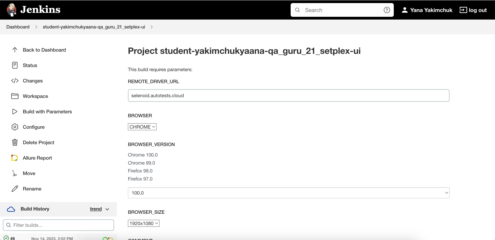
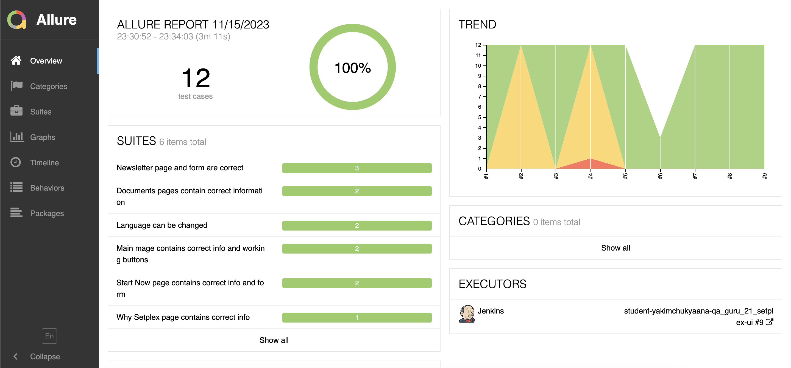
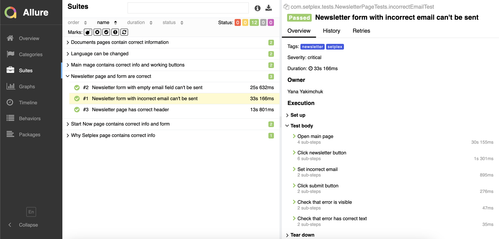
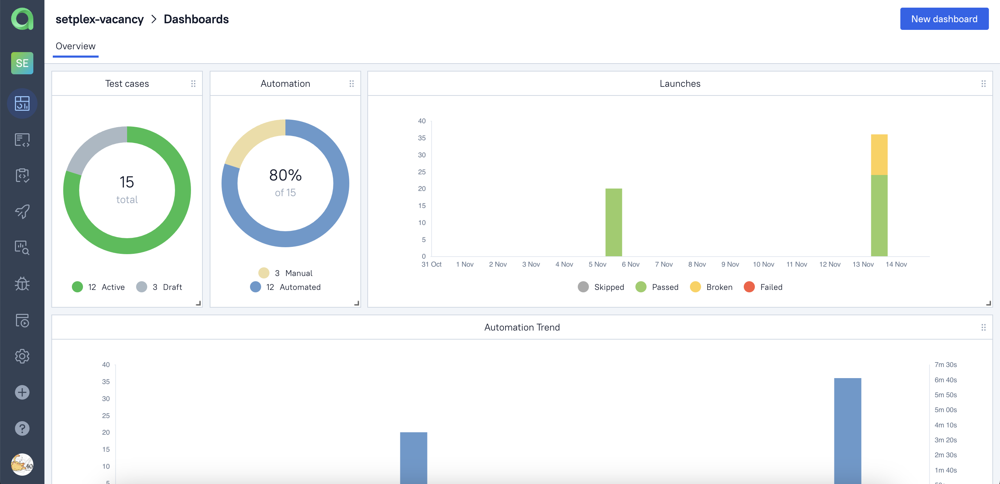
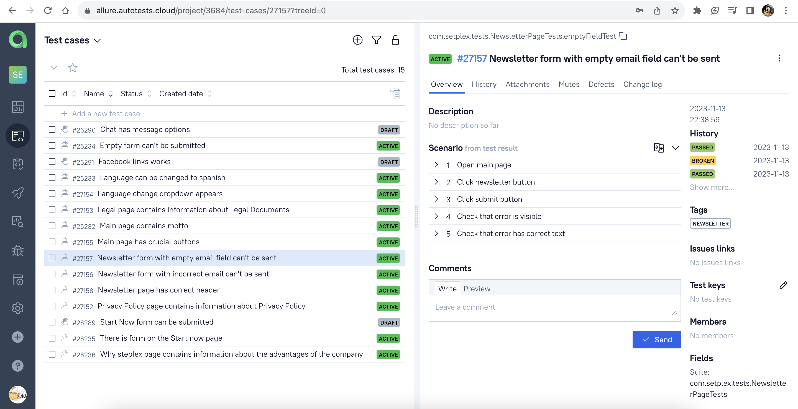
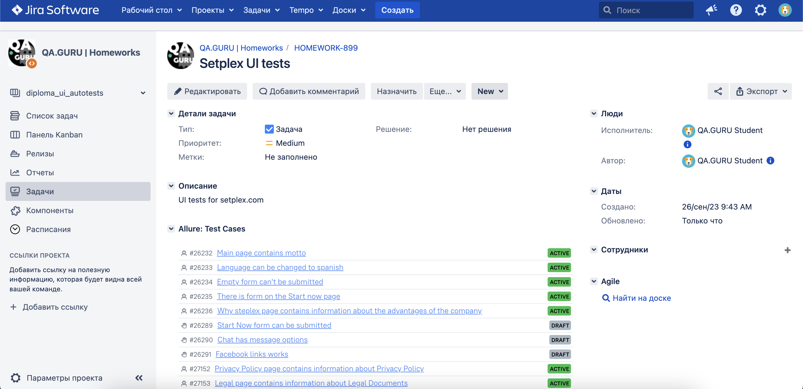
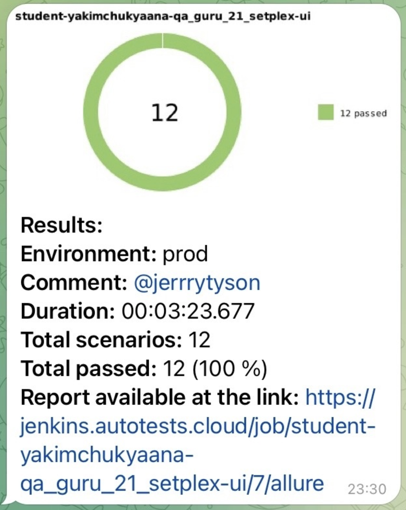

# Project for <a href="https://setplex.com/en/">Setplex</a> QA Automation vacancy

  
</a>  

>Setplex provides highly-scalable, low latency IPTV/OTT solutions for your video. Since 2006 Setplex has redefined the way video is managed and consumed. They focus on delivering the best UI/UX across all their platforms and providing the best quality.
> 
>Source: [Setplex](https://setplex.com/en/our-company.html)

## Contents

- [Technologies and tools](#technologies-and-tools)
- [Test cases](#test-cases)
- [Run tests with Jenkins](#run-tests-with-jenkins)
- [Allure reports](#allure-report)
- [Integration with Allure TestOps](#allure-test-ops)
- [Integration with Jira](#jira)
- [Telegram notifications](#telegram-notifications)
- [Test video](#test-video)

## Technologies and tools

## Test cases

- Check text on the main page
- Check text on the Why Setplex page
- Check that there is a form on Start Now page
- Check that empty form can't be submitted
- Check that language change dropdown appears
- Check that language can be changed
- Check text on Legal page
- Check text on Privacy Policy Page
- Check text on Newsletter page
- Check that newsletter empty form can't be submitted
- Check that newsletter with incorrect email can't be submitted

##  Run tests with <a href='https://jenkins.autotests.cloud/job/student-yakimchukyaana-qa_guru_21_setplex-ui/' title="Jenkins build">Jenkins</a>

To run tests with Jenkins you need to click on the `Build with parameters` button, set the parameters and click `Build`.

  
</a>  

### Parameters

- **BROWSER** - choose a browser for tests (Chrome by default)
- **REMOTE_DRIVER_URL** - where tests will be running (<a href="selenoid.autotests.cloud">selenoid.autotests.cloud</a> by default)
- **BROWSER_SIZE** - size of the browser window (1920x1080 by default)
- **BROWSER_VERSION** - version of the browser (99.0, 100.0 for Chrome, 97.0, 98.0 for Firefox, 85.0, 86.0 for Opera)
- **STAND_BASE_URL** - base url for tests (<a href="https://setplex.com">https://setplex.com</a> by default)
- **ENVIRONMENT** - environment for tests (stage by default)
- **COMMENT** - comment for telegram notifications

##  Allure reports

After running tests allure report is generated. Allure reports can be found on <a href="https://jenkins.autotests.cloud/job/student-yakimchukyaana-qa_guru_21_setplex-ui/">project page in Jenkins</a>.
Allure reports look like <a href="https://jenkins.autotests.cloud/job/student-yakimchukyaana-qa_guru_21_setplex-ui/allure/">this</a>

  
</a>  

### You can click on each test to find details:
- tags
- severity
- duration
- steps
- screenshot
- page source
- browser console logs
- video
- history

  
</a>  

##  Integration with <a href='https://allure.autotests.cloud/project/3684/dashboards'>Allure TestOps</a>

### There you can find all information about crucial things such as:
- <a href="https://allure.autotests.cloud/project/3684/dashboards">dashboards</a>
- <a href="https://allure.autotests.cloud/project/3684/test-cases?treeId=0">test cases</a>
- <a href="https://allure.autotests.cloud/project/3684/launches">launches</a>
- <a href="https://allure.autotests.cloud/project/3684/analytics">analytics</a>
- etc

##  Integration with <a href='https://jira.autotests.cloud/browse/HOMEWORK-899'>Jira</a>

### There is information about:
- priority
- tags
- test cases from Allure TestOps
- test launches
- assignee
- author
- create date
- etc

##  Telegram notifications

After each build test results are sent to a `Telegram` chat. It looks like this

## 🎥 Test video

A video from selenoid is attached to each test in the allure report. There is the example from changing language test.

  

